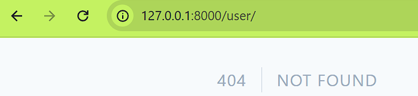
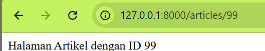

# Jobsheet 1: Instalasi & Konfigurasi Laravel

Nama: Mochamad Reza Firdaus

NIM: 244107020104

Praktikum 1
-	Instalasi Framework Laravel
 

Praktikum 2
-	Menjalankan Web Framework Laravel
 
 

	Praktikum 3 
-	Membuat repository pada github
 
 
Link repo : https://github.com/mochamadx5/PWL_2026 

-	Mengubah Tampilan HTML
 
 
	 

-	Version control atau perubahan kode 
 
 

-	Laravel Hello World
 
 

LINK GITHUB :
https://github.com/mochamadx5/PWL_2026 

# Jobsheet 2 :
-	Praktikum 1 

Menampilkan route Hello 

Menampilkan route world 

Menampilkan selamat datang 

Menampilkan route about (data diri) 

Menampilkan route paramaters user 
Muncul "Not Found" itu karena rute /user/{name} wajib untuk diiisi sesuatu di posisi parameter {name} tersebut.

Menampilkan multi paramaters 
Laravel memungkinkan sebuah route untuk menerima lebih dari satu parameter dinamis sekaligus melalui URL. Parameter yang diketikkan pengguna pada URL akan ditangkap dan diteruskan ke dalam argumen callback function secara berurutan. Selain itu, penamaan variabel di dalam fungsi (seperti $postId dan $commentId) bebas dan tidak harus sama persis dengan nama parameter di route, karena Laravel memetakannya secara otomatis berdasarkan urutan posisinya.

Menampilkan multi paramaters 

-	Praktikum 2 - 