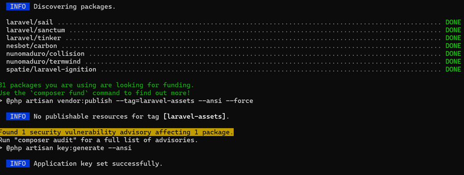
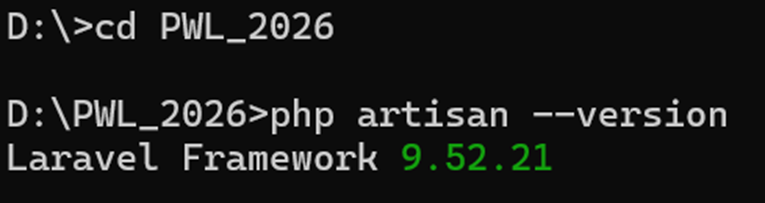
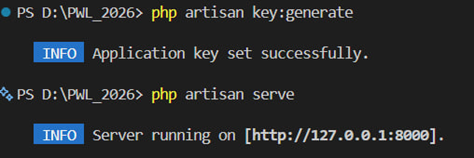
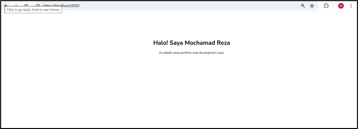
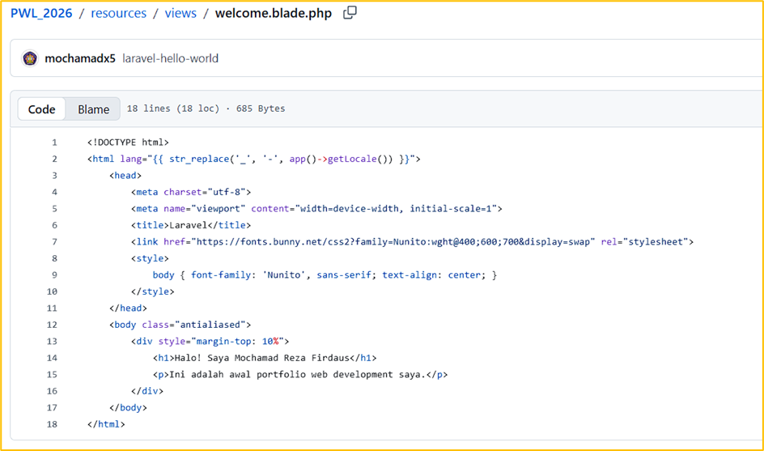
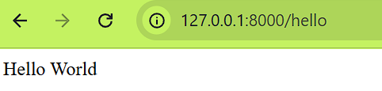
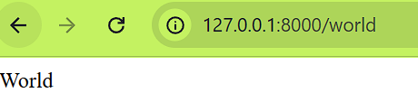
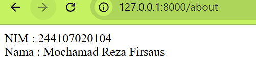

# Jobsheet 1: Instalasi & Konfigurasi Laravel

Nama: Mochamad Reza Firdaus

NIM: 244107020104

Praktikum 1
-	Instalasi Framework Laravel
 

Praktikum 2
-	Menjalankan Web Framework Laravel
 
 

	Praktikum 3 
-	Membuat repository pada github
 
 
Link repo : https://github.com/mochamadx5/PWL_2026 

-	Mengubah Tampilan HTML
 
 
	 

-	Version control atau perubahan kode 
 
 

-	Laravel Hello World
 
 

LINK GITHUB :
https://github.com/mochamadx5/PWL_2026 

# Jobsheet 2 :
-	Praktikum 1 

Menampilkan route Hello 

Menampilkan route world 

Menampilkan selamat datang 

Menampilkan route about (data diri) 

-	Praktikum 2 - 